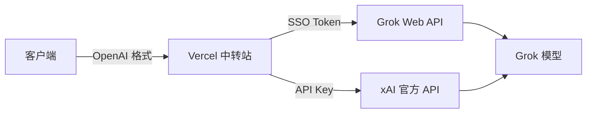

# 🚀 Grok API 中转站

!!! quote "项目简介"
    **Grok API 中转站** — 支持 SSO Token 和 API Key 认证的 Grok 模型代理服务

    ✅ 一键部署到 Vercel ｜ ✅ 兼容 OpenAI API 格式 ｜ ✅ 内置在线聊天 UI

## 🎯 项目特性

*   **OpenAI 兼容** — 支持所有兼容 OpenAI API 的客户端
*   **双重认证** — 支持 SSO Token（grokzhuce 生成）和 xAI API Key
*   **一键部署** — Vercel 一键部署，零服务器成本
*   **在线体验** — 内置 Web 聊天界面，开箱即用
*   **中文优化** — 完整的中文文档与界面

## 🔗 快速入口

<div class="grid cards" markdown>

-   :material-chat-processing:{ .lg .middle } __在线聊天__

    ---

    直接与 Grok 对话

    [:arrow_right: 开始聊天](chat.md)

-   :material-api:{ .lg .middle } __API 文档__

    ---

    开发者接口说明

    [:arrow_right: 查看文档](api.md)

-   :material-brain:{ .lg .middle } __模型参考__

    ---

    可用模型与能力说明

    [:arrow_right: 模型列表](models.md)

-   :material-rocket-launch:{ .lg .middle } __部署指南__

    ---

    Vercel 一键部署教程

    [:arrow_right: 开始部署](zh.md)

</div>

## 🧠 支持的模型

| 模型 | API 标识 | 定位 | 适合场景 |
|---|---|---|---|
| **Grok 3** | `grok-3` | 主力模型 | 通用对话、推理、编程 |
| **Grok 3 Mini** | `grok-3-mini` | 轻量模型 | 快速回复、简单任务 |
| **Grok 4** | `grok-4` | 新一代通用 | 对话、问答、翻译 |
| **Grok 4 Heavy** | `grok-4-heavy` | 高性能 | 编程、分析、复杂推理 |
| **Grok 4.1** | `grok-4-1` | 优化迭代 | 写作、创作、内容生成 |

## 🏗️ 架构说明



## ⚡ 快速开始

### 1. 部署到 Vercel

[](https://vercel.com/new/clone?repository-url=https%3A%2F%2Fgithub.com%2Fxianyu110%2Fgrokapi)

### 2. 配置环境变量

在 Vercel 项目设置中添加：

| 变量名 | 说明 | 必填 |
|---|---|---|
| `GROK_SSO_TOKEN` | Grok SSO Token（JWT 格式） | 二选一 |
| `GROK_API_KEY` | xAI 官方 API Key | 二选一 |
| `AUTH_TOKEN` | 保护中转站的访问令牌 | 可选 |

### 3. 开始使用

```bash
curl -X POST "https://你的域名/v1/chat/completions" \
  -H "Content-Type: application/json" \
  -d '{
    "model": "grok-3",
    "messages": [{"role": "user", "content": "你好！"}]
  }'
```

## ❓ 常见问题

??? question "什么是 SSO Token？"
    SSO Token 是通过 Grok 注册工具（grokzhuce）批量注册获得的会话令牌，
    它是 JWT 格式的字符串，用于验证 Grok 账号身份。

??? question "如何获取 SSO Token？"
    使用 grokzhuce 批量注册工具，注册成功后 Token 保存在 keys/ 目录下。

??? question "SSO Token 和 API Key 有什么区别？"
    - **SSO Token**: 来自注册工具，通过 Grok Web API 通信
    - **API Key**: 从 console.x.ai 获取，通过官方 API 通信
    - 两种方式都支持，优先使用 API Key（更稳定）

??? question "支持哪些客户端？"
    支持所有兼容 OpenAI API 格式的客户端：ChatGPT Next Web、LobeChat、OpenCat、BotGem、Chatbox 等。

---

!!! warning "免责声明"
    - 本项目不隶属于 xAI 或 Grok 官方
    - 内容仅用于技术学习与交流
    - 请勿输入个人隐私或敏感信息
    - 实际模型能力以平台实现为准

## 🌟 支持项目

如果本项目对你有帮助，欢迎 **Star ⭐ / Fork 🍴 / 分享**
